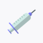

## VCR App

A cross-platform vaccination centre recommendation mobile application for vaccine recipients to make vaccination appointments at any nearby recommended vaccination centre.

## Technologies Used

- React Native
- Expo managed workflow

## Development Requirement

- Node.js v16
- Android Studio/Xcode

## Development Guide

1. Clone this repo

```
git clone https://github.com/jason-dev1/vcr-frontend.git
```

2. Install Node.js dependency packages

```
cd vcr-frontend
npm i
```

3. Run project

```
npm start
```

The VCR app can be executed on either Android or iOS device/emulator by opening the URL or scanning the QR code with Expo app.

## Screenshots

### Login & Registration Screen


### Home Screen


### Appointment Screen


### Make Appointment Screen


### Timeline Screen


### Profile Screen


